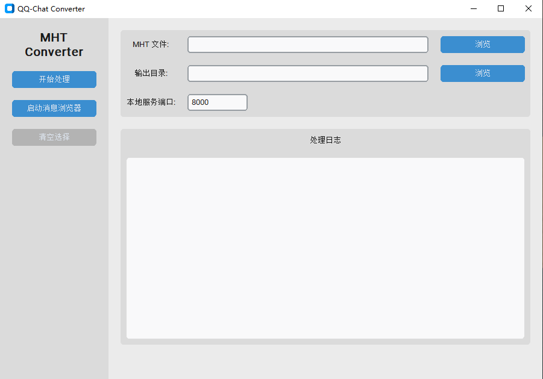
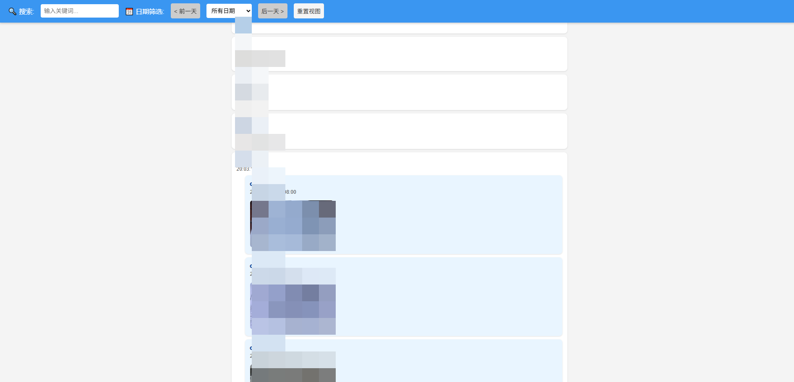

# QQ-Chat-Converter

[中文文档](README_CN.md)

Convert qq-chat exported *.mht file to structured JSON (along with image folder). Also provide a simple local viewer.

## Prepare Your Chat Data
QQ(< 9.7.25) -> Messange Manger -> Choose Contact (Group) -> "Right Click" -> Export Chat as *.mht file (the only way that preserves images).

## Quick Start
### Python Commands
1. Clone this repo via `git clone https://github.com/kkaiwwana/qq-chat-converter.git` , and then `cd qq-chat-converter` .

2. Export *.mht file via `python .\scripts\convert_mht.py [YOUR-PATH-TO-MHT-FILE]` . The default ouput dir is `./out_dir` and the folder is same as your mht file.

3. A `index.html` file will be also generated in `out_dir/[MHT_FILE_NAME]` which is a local viewer. But, you need run it on a local html server instead of double-clicking it. Specifically, use `python -m http.server 8000` to launch a local html server and visit `http://localhost:8000/[PATH-TO-YOUR-OUT-DIR]/index.html` .

### GUI Program
Simply use `python .\GUI\qq-chat-converter.py` to start up a GUI program and have fun!

> [!TIP]
> You can use `Start Message Browser` button to launch a HTML server and then browse the exported chat. Moreover, when exported dir is not specified (or cleaned by clicking `clear` button), you can also start a HTML server and visit any dir you'd like to open. **So you can visit your output dir, and browse all your exported chats.** 

### Excutable File
You can simply download excutable file in release page！ Have fun :)

> [!TIP]
> Build it on your own via `pyinstaller -w --onefile --add-data "GUI\resources;resources" .\GUI\qq-chat-converter-gui.py`. Notably, please consider pack it in a minimal enviroment to avoid including massive but useless packages if without advanced packing setup.

## Chat-Browser

With this simple and **local** (offline usable; without any Internet request) chat-browser (viewer) which loads exported JSON file, you can:

- Search message and jump to the context by simply clicking.
- Read clearly structured forwarded messages and images.
- Select by chat data by date and **only date with chat data will be presented in the list**. Jump to prior/next day freely.
- Check full resolution image by simly clicking.

## License
This project is open-source under GPL-3.0 license. Consider give it a star if you find it helpful : )